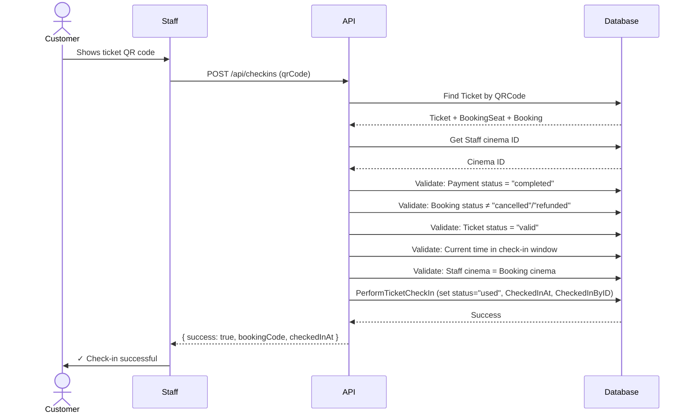
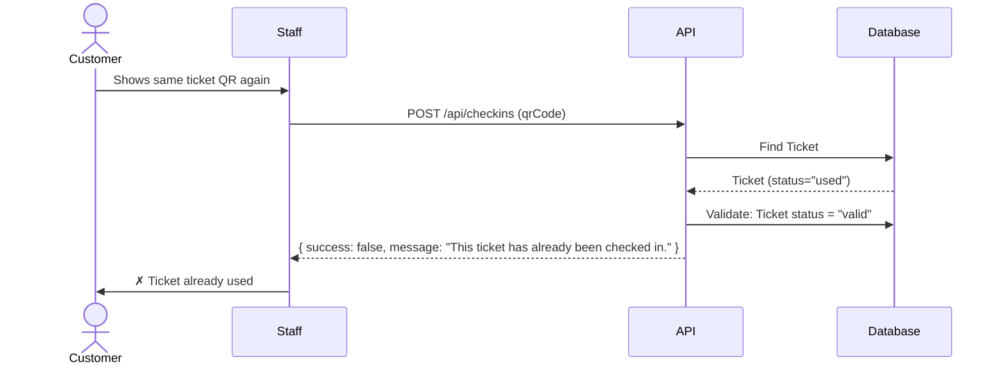
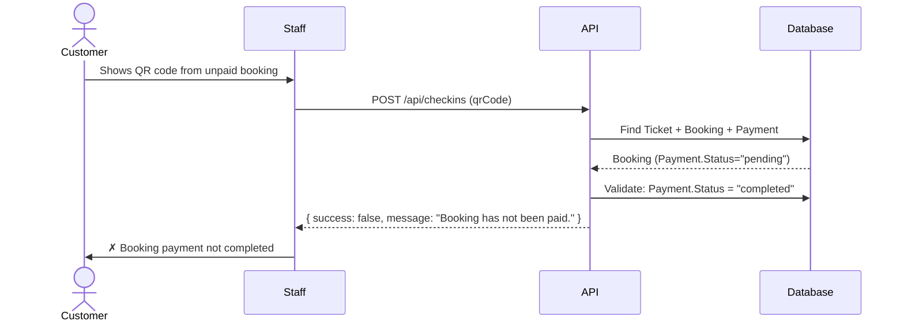
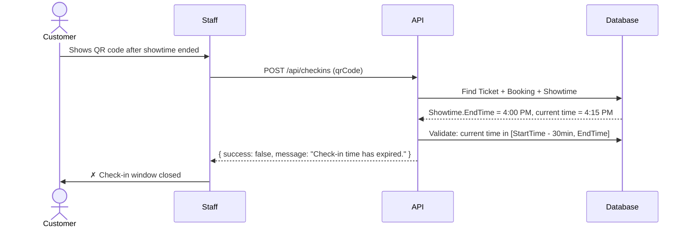

# Check-in Module Documentation

## 1. Module Overview

### Purpose

The Check-in Module manages the ticket validation and check-in process when customers arrive at the cinema. It verifies that tickets are legitimate, paid, and have not already been used, then marks them as checked in for attendance tracking and analytics.

### Why Check-in Exists

- **Attendance Verification**: Ensures customers who purchased tickets actually attend the screening
- **Revenue Protection**: Prevents duplicate usage of the same ticket (one ticket = one seat use)
- **Operational Insight**: Provides cinema staff with no-show rates and attendance data
- **Security**: Validates QR codes to prevent fraudulent or counterfeit tickets
- **Audit Trail**: Records who checked in which ticket at what time and from which IP address

### Actors

1. **Customer**: Purchases tickets, receives QR codes, uses them for check-in at cinema
2. **Staff**: Scans QR codes and processes check-ins at the cinema location
3. **Manager**: Views check-in history across staff members and time periods at their assigned cinema
4. **Admin**: Views check-in history across all cinemas, staff members, and time periods

---

## 2. Business Flow

```
Customer books ticket
        ↓
   Payment success
        ↓
   QR Code generated (per ticket/seat)
        ↓
Customer arrives at cinema
        ↓
Staff scans QR code (lookup or check-in)
        ↓
Booking validation (payment, status, time window, cinema assignment)
        ↓
Ticket validation (not already checked in, not refunded, not cancelled)
        ↓
Check-in success (ticket marked as used)
        ↓
Booking/Ticket status updated (with timestamp and staff ID)
```

### Step-by-Step Explanation

1. **Customer Books Ticket**: Customer selects movie, showtime, seats, and completes booking in the system.

2. **Payment Success**: Payment is processed and marked as "completed". The booking status transitions to "paid".

3. **QR Code Generated**: Each seat in the booking gets its own ticket with a unique QR code. The QR code contains the ticket ID and is stored in the `Ticket.QRCode` field.

4. **Customer Arrives at Cinema**: Customer physically arrives at the cinema before the showtime. Check-in is allowed starting 30 minutes before showtime start time through the end of the showtime.

5. **Staff Scans QR Code**: A staff member at the cinema uses a QR code scanner to scan the customer's ticket. The QR code is provided to one of two APIs:
   - **Lookup API**: Returns full booking and ticket details (customer name, movie, seats, products, etc.) for staff verification
   - **Check-in API**: Performs the actual check-in if all validations pass

6. **Booking Validation**: The system validates:
   - Booking exists and belongs to the correct showtime
   - Payment status is "completed"
   - Booking status is not "cancelled" or "refunded"
   - Showtime belongs to the staff member's assigned cinema
   - Current time is within the check-in window (30 minutes before start through end time)

7. **Ticket Validation**: The system validates:
   - Ticket exists and is linked to a valid booking
   - Ticket status is "valid" (not "used", "refunded", or "cancelled")
   - No completed refunds exist on the booking

8. **Check-in Success**: If all validations pass:
   - Ticket status is set to "used"
   - `Ticket.CheckedInAt` is set to current UTC timestamp
   - `Ticket.CheckedInByID` is set to the staff member's user ID
   - IP address of the staff scanner is recorded (if available)

9. **Status Update**: The check-in is recorded with timestamp for audit purposes. The customer's attendance is now recorded.

---

## 3. QR Code

### What Information QR Contains

Each QR code encodes a ticket ID in string format. The actual ticket ID is used as the QR code value. When scanned, this QR code is looked up in the database to retrieve:
- Associated Ticket record
- BookingSeat (which seat is booked)
- Booking (customer, showtime, payment, status)
- Showtime (movie, room, cinema, start/end times)
- Payment (payment status)
- Refunds (if any completed refunds exist)

The QR code itself does not contain all booking details; it serves as a key to retrieve them from the database.

### Why BookingCode/QRCode is Used

- **BookingCode**: A human-readable identifier for the entire booking (e.g., "CGV2024001"). Useful for customers to reference their booking and for staff to look up manually if needed.
- **QRCode**: A machine-readable identifier (ticket ID as string) for each individual ticket. Allows fast, error-free scanning at check-in.

The distinction is important: one booking can have multiple seats, so one BookingCode maps to multiple QRCodes (one per seat).

### One Booking, Multiple QR Codes

**Yes, one booking has multiple QR codes — one per seat.**

If a customer books 4 seats in one transaction:
- 1 Booking record (BookingID = 1, BookingCode = "CGV2024001")
- 4 BookingSeat records (linking Booking to each Seat)
- 4 Ticket records (one per BookingSeat)
- 4 unique QR codes (one per Ticket)

When the group arrives, each person scans their own ticket's QR code. All 4 check-ins are recorded against the same booking.

### Multiple Seats in One Booking

When checking in a booking with multiple seats:
- Each seat's ticket is checked in independently
- The `CheckInLookupResponse.CheckedIn` field indicates whether *any* seat in the booking is already checked in (boolean)
- The `CheckInLookupResponse.Seats` list shows the check-in status of each individual seat:
  - `IsCheckedIn`: whether this specific seat is checked in
  - `CheckedInAt`: timestamp for this specific seat's check-in

This allows partial group check-ins: if 2 of 4 friends arrive late, their 2 tickets can be checked in while the others' remain valid.

### Security Considerations

- **QR Code Format**: QR codes are generated as strings representing ticket IDs. No encryption or hashing is applied (assumption: QR codes are not sensitive and are meant to be shareable).
- **No Expiration in QR Code**: The QR code itself does not expire; expiration is enforced at the database level (time window validation, booking status checks).
- **Uniqueness**: Each ticket gets exactly one QR code; QR codes are unique within the system.
- **Scanning Validation**: QR codes are only valid during the 30-minute pre-showtime window through end of showtime. Scanning outside this window fails validation.
- **Assumption**: The system does not currently implement QR code encryption, obfuscation, or anti-tampering mechanisms. QR codes are treated as public (they can be shared, photographed, forwarded).

### Expired QR Handling

**Expired QR codes are not explicitly "marked expired"** but are rejected at validation time:

1. **Time Window Check**: If the current time is outside the check-in window (before -30 min or after showtime end), the check-in fails with error `"Check-in time has expired."` regardless of whether the QR code ever worked.

2. **Ticket Status Check**: If the ticket was successfully checked in before (status = "used"), attempting to check it in again fails with `"This ticket has already been checked in."` 

3. **Refund Check**: If the booking was refunded (Refund with status = "completed" exists), the check-in fails with `"Ticket has been refunded."` regardless of time window.

4. **Booking Status Check**: If the booking was cancelled, the check-in fails with `"Booking has been cancelled."` regardless of time window.

So "expiration" is handled by state machine rules, not by pre-marking QR codes as expired. A QR code that was valid at 2 PM may be invalid at 4 PM simply because the showtime ended.

---

## 4. Validation Rules

All validation rules implemented in `CheckInService.CheckInAsync()`:

| # | Validation | Purpose | Error Message | Business Reason |
|---|-----------|---------|---------------|-----------------|
| 1 | Ticket exists | Ensure QR code is valid and not forged | `"Ticket not found."` | Prevents fraudulent tickets |
| 2 | Ticket has complete booking data | Prevent null reference errors and ensure booking is loadable | `"Ticket data is incomplete (missing booking)."` | Database consistency check |
| 3 | Staff has cinema assignment | Verify staff member is authorized to check in | `"Staff cinema assignment not found."` | Authorization & security |
| 4 | Booking has complete showtime/room/cinema data | Prevent null reference errors and ensure showtime is loadable | `"Booking data is incomplete (missing showtime/room/cinema)."` | Database consistency check |
| 5 | Booking belongs to staff's cinema | Ensure staff only checks in at their assigned location | `"You cannot check in tickets from another cinema."` | Multi-cinema security & accountability |
| 6 | Payment status is "completed" | Ensure booking is paid before check-in | `"Booking has not been paid."` | Revenue protection (no free admission) |
| 7 | Booking status is not "cancelled" | Prevent checking in cancelled bookings | `"Booking has been cancelled."` | Booking state machine enforcement |
| 8 | No completed refunds on booking | Prevent checking in refunded bookings | `"Ticket has been refunded."` | Prevent double-usage of refunded seats |
| 9 | Ticket status is not "used" | Prevent duplicate check-in of same ticket | `"This ticket has already been checked in."` | Revenue protection (one ticket = one use) |
| 10 | Ticket status is not "cancelled" | Prevent checking in cancelled tickets | `"This ticket has been cancelled."` | Ticket state machine enforcement |
| 11 | Ticket status is not "refunded" | Prevent checking in refunded tickets | `"This ticket has been refunded."` | Prevent double-usage of refunded seats |
| 12 | Current time within check-in window | Ensure check-in only during valid hours | `"Check-in time has expired."` | Operational policy (30 min pre-showtime through showtime end) |

**Check-in Window Details**:
- **Earliest**: 30 minutes before showtime start (e.g., if showtime is 2:00 PM, earliest check-in is 1:30 PM)
- **Latest**: At showtime end time (e.g., if showtime ends at 4:00 PM, check-in closes at 4:00 PM)
- **Validation**: `now >= (StartTime - 30 min) AND now <= EndTime`

---

## 5. Check-in Permissions

### Customer

Customers can:
- Generate QR codes for their booked tickets (automatic upon payment)
- View their own booking details (outside Check-in Module scope)
- **Cannot**: Lookup, check-in, or view check-in history (these are staff-only operations)

### Staff

Staff can:
- **Lookup**: Call `POST /api/checkins/lookup` to get full booking/ticket details by scanning a QR code
- **Check-in**: Call `POST /api/checkins` to mark a ticket as used
- **Restrictions**: 
  - Can only check in tickets from their assigned cinema
  - Can only view their own check-in history (when viewing check-in history as staff)
- **Cannot**: View other staff's check-ins or modify their check-ins

### Manager

Manager can:
- **Lookup & Check-in**: Same as Staff
- **View History**: Call `GET /api/checkins/history` with optional filters
- **Restrictions**:
  - Can only view check-ins at their assigned cinema (cinema assignment is inferred from their staff record)
  - Cannot filter by other cinemas
  - Can filter by staff member, date range, etc., within their cinema
- **Cannot**: View cross-cinema check-ins

### Admin

Admin can:
- **Lookup & Check-in**: Same as Staff
- **View History**: Call `GET /api/checkins/history` with full filtering capabilities
- **No Restrictions**: Can view all cinemas, all staff, all check-ins across the entire system
- Admin is the only role that can query check-in history without cinema restrictions

### Authorization Enforcement

Each API endpoint checks the requester's role:

```
POST /api/checkins/lookup     → [Authorize(Roles = "staff")]
POST /api/checkins            → [Authorize(Roles = "staff")]
GET /api/checkins/history     → [Authorize(Roles = "staff, manager, admin")]
```

Additional logic in `GetHistoryAsync()` enforces cinema filtering based on role.

---

## 6. Booking Status Changes

### Booking Lifecycle

```
pending  →  paid  →  used  →  completed
                ↓
            cancelled
                ↓
            refunded
```

**Note on "used" vs "completed"**: 
- `used` = at least one seat was checked in
- `completed` = showtime has ended (assumed to be set by a background job, not by Check-in Module)
- The Check-in Module does NOT change booking status to "used" or "completed"; it only validates the current status and changes ticket status to "used"

**Assumption**: The booking status is managed by Booking Module or background jobs, not by Check-in Module. The Check-in Module only validates and prevents check-ins for cancelled/refunded bookings.

### Cancellation Path

- Booking status → "cancelled"
- Check-in Module rejects further check-ins with error: `"Booking has been cancelled."`

### Refund Path

- Booking status → "refunded" (or "partially_refunded")
- Refund record is created with status → "completed"
- Check-in Module rejects further check-ins with error: `"Ticket has been refunded."`
- Note: Refund can occur *after* partial check-ins; once refunded, no further check-ins allowed even for unchecked seats

### Ticket Status Changes During Check-in

Ticket lifecycle:

```
valid  →  used  →  (end of lifecycle)
  ↓
refunded
  ↓
cancelled
```

When check-in succeeds:
- Ticket.Status → "used"
- Ticket.CheckedInAt → current UTC time
- Ticket.CheckedInByID → staff member's user ID

---

## 7. Sequence Diagrams

### A. Successful Check-in Sequence



### B. Failed Check-in — Already Checked In



### C. Failed Check-in — Payment Not Completed



### D. Failed Check-in — Wrong Cinema

```mermaid
sequenceDiagram
    actor Customer
    participant StaffCinemaA
    participant API
    participant Database

    Customer->>StaffCinemaA: Shows QR code for Cinema B showtime
    StaffCinemaA->>API: POST /api/checkins (qrCode)
    API->>Database: Find Ticket + Booking + Showtime
    Database-->>API: Booking.Showtime.Cinema = Cinema B
    API->>Database: Get StaffCinemaA's cinema = Cinema A
    API->>Database: Validate: Staff cinema = Booking cinema
    API-->>StaffCinemaA: { success: false, message: "You cannot check in tickets from another cinema." }
    StaffCinemaA->>Customer: ✗ Cannot check in; wrong cinema
```

### E. Failed Check-in — Outside Time Window



---

## 8. API Documentation

### POST /api/checkins/lookup

**Purpose**: Retrieve full booking and ticket details for staff verification before check-in.

**Authorization**: `[Authorize(Roles = "staff")]`

**Request**:
```json
{
  "qrCode": "string (required, max 100 chars)"
}
```

**Response** (Success, HTTP 200):
```json
{
  "success": true,
  "data": {
    "bookingId": 123,
    "bookingCode": "CGV2024001",
    "customerName": "John Doe",
    "movie": {
      "title": "The Matrix",
      "rating": "PG-13",
      "duration": 136,
      "posterUrl": "https://..."
    },
    "cinema": {
      "name": "CGV Downtown",
      "address": "123 Main St"
    },
    "room": {
      "name": "Theater 1",
      "roomType": "IMAX"
    },
    "showtime": {
      "startTime": "2024-12-15T19:00:00Z",
      "endTime": "2024-12-15T21:00:00Z"
    },
    "paymentStatus": "success",
    "bookingStatus": "paid",
    "checkedIn": true,
    "seats": [
      {
        "row": "A",
        "column": 5,
        "seatType": "Standard",
        "ticketPrice": 150000,
        "isCheckedIn": true,
        "checkedInAt": "2024-12-15T18:55:00Z"
      },
      {
        "row": "A",
        "column": 6,
        "seatType": "Standard",
        "ticketPrice": 150000,
        "isCheckedIn": false,
        "checkedInAt": null
      }
    ],
    "products": [
      {
        "productName": "Popcorn Large",
        "quantity": 1,
        "unitPrice": 80000,
        "subtotal": 80000
      }
    ]
  }
}
```

**Response** (Error, HTTP 4xx):
```json
{
  "success": false,
  "message": "Error message"
}
```

**Common Errors**:
- `"Ticket not found."` (HTTP 404)
- `"You cannot check in tickets from another cinema."` (HTTP 403)
- `"Ticket data is incomplete (missing booking)."` (HTTP 400)
- `"Booking data is incomplete (missing showtime/room/cinema)."` (HTTP 400)
- `"Staff cinema assignment not found."` (HTTP 400)

---

### POST /api/checkins

**Purpose**: Perform the actual check-in of a ticket. Marks ticket as "used" and records check-in timestamp and staff ID.

**Authorization**: `[Authorize(Roles = "staff")]`

**Request**:
```json
{
  "qrCode": "string (required, max 100 chars)"
}
```

**Response** (Success, HTTP 200):
```json
{
  "success": true,
  "message": "Ticket checked in successfully.",
  "bookingCode": "CGV2024001",
  "checkedInAt": "2024-12-15T18:55:30Z"
}
```

**Response** (Conflict - Already Checked In, HTTP 409):
```json
{
  "success": false,
  "message": "This ticket has already been checked in."
}
```

**Response** (Error, HTTP 4xx):
```json
{
  "success": false,
  "message": "Error message"
}
```

**Common Errors**:
- `"Ticket not found."` (HTTP 404)
- `"This ticket has already been checked in."` (HTTP 409)
- `"Booking has not been paid."` (HTTP 400)
- `"Booking has been cancelled."` (HTTP 400)
- `"Ticket has been refunded."` (HTTP 400)
- `"Check-in time has expired."` (HTTP 400)
- `"You cannot check in tickets from another cinema."` (HTTP 403)

**Permissions**:
- Only staff at the booking's cinema can perform check-in
- Staff cannot check in tickets from other cinemas

---

### GET /api/checkins/history

**Purpose**: Retrieve paginated check-in history with optional filtering by staff, cinema, and date range.

**Authorization**: `[Authorize(Roles = "staff, manager, admin")]`

**Query Parameters**:
- `staffId` (optional): Filter by staff member who performed the check-in
- `cinemaId` (optional): Filter by cinema location (admin-only; staff/manager are restricted to their own cinema)
- `from` (optional): Start date for filtering (ISO 8601 format)
- `to` (optional): End date for filtering (ISO 8601 format)
- `page` (required, default 1): Page number (must be ≥ 1)
- `pageSize` (required, default 20): Records per page (must be 1-100)

**Response** (Success, HTTP 200):
```json
{
  "success": true,
  "data": {
    "records": [
      {
        "bookingId": 123,
        "bookingCode": "CGV2024001",
        "customerName": "John Doe",
        "movieTitle": "The Matrix",
        "cinemaName": "CGV Downtown",
        "roomName": "Theater 1",
        "showtimeStart": "2024-12-15T19:00:00Z",
        "checkedInAt": "2024-12-15T18:55:30Z",
        "staffName": "Jane Smith",
        "seatCount": 4,
        "totalAmount": 750000
      }
    ],
    "totalCount": 250,
    "page": 1,
    "pageSize": 20
  }
}
```

**Permission Enforcement**:
- **Staff**: Can only view check-ins they performed; cinema is automatically their assigned cinema
- **Manager**: Can view all check-ins at their assigned cinema
- **Admin**: Can view all check-ins across all cinemas

**Role-Based Filtering**:
```
Staff viewing:     staffId is forced to current user ID, cinema ignored
Manager viewing:   cinemaId is forced to their assigned cinema, staffId optional
Admin viewing:     both staffId and cinemaId are optional, fully customizable
```

---

## 9. Database Schema

### Relevant Tables and Relationships

#### Booking
| Column | Type | Notes |
|--------|------|-------|
| BookingID | int | Primary key |
| BookingCode | string | Human-readable booking identifier (e.g., "CGV2024001") |
| UserID | int? | Customer who made the booking (nullable for staff-created bookings) |
| ShowtimeID | int | Showtime this booking is for |
| CreatedByStaffID | int? | Staff member who created this booking (if applicable) |
| Status | string | "pending", "paid", "cancelled", "refunded", "used", "expired", "payment_failed", "partially_refunded" |
| QRCode | string? | Not used for individual check-ins; kept for backward compatibility |
| SubTotal | decimal | Sum of ticket prices |
| DiscountAmount | decimal | Discounts applied |
| FinalAmount | decimal | Total after discounts |
| BookingDate | datetime | When booking was created |
| UpdatedAt | datetime | Last update timestamp |

**Relationships**:
- Booking → User (customer)
- Booking → Showtime
- Booking → User (created by staff)
- Booking → Payment (one-to-one)
- Booking → BookingSeat (one-to-many)
- Booking → Refund (one-to-many)

#### Ticket
| Column | Type | Notes |
|--------|------|-------|
| TicketID | int | Primary key; also used as the QR code value |
| BookingSeatID | int | Link to the specific seat in the booking |
| QRCode | string | Unique QR code (typically = TicketID as string) |
| Status | string | "valid", "used", "refunded", "cancelled" |
| CheckedInAt | datetime? | When the ticket was checked in (UTC) |
| CheckedInByID | int? | Staff member who performed the check-in |

**Relationships**:
- Ticket → BookingSeat (one-to-one)
- Ticket → User (checked in by)

#### BookingSeat
| Column | Type | Notes |
|--------|------|-------|
| BookingSeatID | int | Primary key |
| BookingID | int | Which booking this seat belongs to |
| SeatID | int | Which physical seat is booked |
| TicketPrice | decimal | Price of this seat's ticket |

**Relationships**:
- BookingSeat → Booking
- BookingSeat → Seat
- BookingSeat → Ticket (one-to-one, reverse direction)

#### Payment
| Column | Type | Notes |
|--------|------|-------|
| PaymentID | int | Primary key |
| BookingID | int | Which booking this payment is for |
| PaymentMethod | string | e.g., "credit_card", "wallet", "cash" |
| Amount | decimal | Amount paid |
| TransactionCode | string? | External payment processor transaction ID |
| Status | string | "pending", "success", "failed", "expired", "refunded", "cancelled" |
| PaidAt | datetime? | When payment was completed |
| CreatedAt | datetime | When payment record was created |

**Relationships**:
- Payment → Booking (one-to-one)
- Payment → Refund (one-to-many)

#### Showtime
| Column | Type | Notes |
|--------|------|-------|
| ShowtimeID | int | Primary key |
| MovieID | int | Which movie is showing |
| RoomID | int | Which room (cinema location + auditorium) |
| StartTime | datetime | When the screening starts |
| EndTime | datetime | When the screening ends |
| BasePrice | decimal | Base ticket price for this showtime |
| RoomExtraPrice | decimal | Room-specific surcharge (e.g., IMAX premium) |
| Status | string | "scheduled", etc. |

**Relationships**:
- Showtime → Movie
- Showtime → Room

#### Room
| Column | Type | Notes |
|--------|------|-------|
| RoomID | int | Primary key |
| CinemaID | int | Which cinema this room belongs to |
| RoomName | string | e.g., "Theater 1", "Screen A" |

**Relationships**:
- Room → Cinema

#### Cinema
| Column | Type | Notes |
|--------|------|-------|
| CinemaID | int | Primary key |
| CinemaName | string | e.g., "CGV Downtown" |
| Address | string | Street address |

#### User
| Column | Type | Notes |
|--------|------|-------|
| UserID | int | Primary key |
| FullName | string | Customer or staff member name |

**Relationships**:
- User (staff) → Cinema (assignment via a separate staff/cinema junction table, not shown here)

#### Refund
| Column | Type | Notes |
|--------|------|-------|
| RefundID | int | Primary key |
| BookingID | int | Which booking was refunded |
| PaymentID | int? | Which payment record (if applicable) |
| Amount | decimal | Refund amount |
| Status | string | "pending", "completed" |
| RequestedAt | datetime | When refund was requested |
| CompletedAt | datetime? | When refund was completed |

**Relationships**:
- Refund → Booking
- Refund → Payment

### Key Relationships for Check-in

```
Ticket (TicketID as QRCode)
  → BookingSeat (BookingSeatID)
    → Booking (BookingID)
      → Payment (BookingID, Status must be "success")
      → Showtime (ShowtimeID)
        → Room (RoomID)
          → Cinema (CinemaID) [must match staff's cinema]
        → Movie (MovieID)
      → Refund (BookingID, check for completed status)
      → User (UserID) [customer name]
    → Seat (SeatID)
  → User (CheckedInByID) [staff who performed check-in]
```

---

## 10. Edge Cases

### Duplicate Scan

**Scenario**: Staff scans the same ticket QR code twice.

**Current Behavior**: 
- First scan: Check-in succeeds, ticket status → "used"
- Second scan (within same day or later): Check-in fails with HTTP 409 Conflict: `"This ticket has already been checked in."`

**Handling**: The duplicate is rejected at validation step 9 (Ticket.Status != "used"). This prevents double-counting and protects revenue.

**No Reconciliation**: System does not track or auto-reconcile duplicate scans. If a duplicate occurs, it's logged in the attempt (staff ID, IP address, timestamp), and only the first check-in is recorded successfully.

### Late Arrival

**Scenario**: Customer arrives after the showtime has started (but before it ends).

**Current Behavior**: 
- Check-in is **allowed** if `now <= showtime.EndTime`
- A customer arriving 10 minutes into a 2-hour movie can still check in

**Rationale**: Cinema operations allow late entry (especially for multiplex visits). The system only closes check-in at the showtime's end time.

**Assumption**: Attendance verification is the goal; the movie's actual start time is not a hard barrier.

### Wrong Cinema

**Scenario**: Customer has a ticket for Cinema A but scans at Cinema B.

**Current Behavior**: 
- Lookup or check-in fails with HTTP 403 Forbidden: `"You cannot check in tickets from another cinema."`

**Handling**: 
1. Staff at Cinema B scans the QR
2. System retrieves the ticket and booking
3. System looks up Cinema B staff member's assigned cinema
4. System compares: booking.showtime.room.cinema.id != staffCinemaA.id
5. Request rejected before any validation runs

**Security**: This prevents staff at one cinema from impersonating customers at another cinema or from checking in someone else's ticket.

### Refunded Booking

**Scenario**: After some seats are checked in, the booking is refunded.

**Current Behavior**: 
- Checked-in seats remain "used" (past transactions are not reversed)
- **Future** check-in attempts for unchecked seats fail with: `"Ticket has been refunded."`
- Refund system marks all ticket statuses as "refunded"

**Rationale**: Refund is a business decision that applies to the entire booking. Once refunded, no further check-ins are allowed, even if some seats remain unchecked. This simplifies refund-chargeback logic.

**Assumption**: Refund workflow is handled by the Refund Module, not Check-in Module.

### Cancelled Booking

**Scenario**: Staff tries to check in a cancelled booking.

**Current Behavior**: Check-in fails with: `"Booking has been cancelled."`

**Handling**: Validation step 7 prevents any check-ins for bookings with status "cancelled".

**Note**: Cancelled bookings are distinct from unpaid bookings. A cancelled booking is one the customer explicitly cancelled (and likely received a refund); an unpaid booking is one where payment is still pending.

### Payment Pending

**Scenario**: Customer booked seats but payment hasn't completed yet (status = "pending").

**Current Behavior**: Check-in fails with: `"Booking has not been paid."`

**Handling**: Validation step 6 enforces `payment.status == "completed"` before allowing check-in.

**Rationale**: No free admission. The cinema only admits paid customers.

### Multiple Seats, Partial Check-in

**Scenario**: Group of 4 friends books 4 seats; 2 arrive on time, 2 are late.

**Current Behavior**: 
- 2 friends scan their tickets and check in successfully
- 2 friends' tickets remain "valid"
- Booking status remains "paid" (Check-in Module doesn't change booking status)
- `CheckInLookupResponse.Seats` shows per-seat check-in status

**Lookup Response** (after first 2 friends checked in):
```json
"seats": [
  {"row": "A", "column": 1, "isCheckedIn": true, "checkedInAt": "2024-12-15T18:55:00Z"},
  {"row": "A", "column": 2, "isCheckedIn": true, "checkedInAt": "2024-12-15T18:55:10Z"},
  {"row": "A", "column": 3, "isCheckedIn": false, "checkedInAt": null},
  {"row": "A", "column": 4, "isCheckedIn": false, "checkedInAt": null}
]
```

**Assumption**: Partial check-ins are allowed and tracked individually per seat. No "all or nothing" logic.

### Multiple Staff Scanning Simultaneously

**Scenario**: Two staff members at the same cinema scan tickets for the same booking (e.g., fast lane + regular lane).

**Current Behavior**: 
- First scan: Check-in succeeds, ticket marked "used"
- Second scan (milliseconds later): Fails with `"This ticket has already been checked in."`

**Race Condition**: In theory, if both queries execute before the first writes (low probability), both could succeed. Current design assumes single-threaded or rapid sequential database updates. Database transactions are enforced at the repository level to prevent this.

**Assumption**: Database-level optimistic or pessimistic locking prevents race conditions (not explicitly implemented in Check-in Service shown, but assumed by repository layer).

### Offline Scanner

**Status**: **Not currently supported.**

**Assumption**: All scanning requires a live connection to the API. There is no offline check-in capability, no local cache, and no sync-later mechanism.

**Implication**: A cinema with connectivity issues cannot check in customers until the API is restored. This is a known limitation.

**Future Improvement** (Section 12): Implement offline check-in with local SQLite cache and background sync.

---

## 11. Security

### Authorization

**Role-Based Access Control (RBAC)**:
- `[Authorize(Roles = "staff")]` enforces that only staff (or higher roles) can access check-in endpoints
- Staff can only check in at their assigned cinema (validated in service)
- Managers can view check-in history only for their cinema
- Admins have unrestricted access

**Cinema Boundary Enforcement**:
- Every check-in validates that the staff member's assigned cinema matches the booking's showtime cinema
- Prevents unauthorized cross-cinema access
- Enforced at the service layer before any state changes

### QR Code Validation

**No Encryption**: QR codes are not encrypted; they are plaintext ticket IDs. Assumption: QR codes are not sensitive and can be shared/forwarded by customers.

**Format Validation**: QR code must be a string ≤ 100 characters (enforced by `[MaxLength(100)]` on request DTOs).

**Existence Check**: Every QR code is validated against the Ticket table before any check-in operation. Invalid/forged QR codes are rejected with `"Ticket not found."` (HTTP 404).

**Uniqueness**: Each ticket has exactly one QR code; QR codes are unique within the system (enforced by database schema, not re-validated per check-in).

### Replay Attack Prevention

**Mechanism**: Ticket status after check-in is set to "used". Attempting to replay (re-scan) the same QR code fails with `"This ticket has already been checked in."` (HTTP 409).

**Strength**: Strong. One-time use is enforced at the database level.

**Assumption**: Replays are detected immediately (same day, same cinema); there is no time delay or multi-cinema replay scenario to consider.

### Audit Logging

**What is Logged**:
- **Ticket.CheckedInAt**: UTC timestamp of check-in
- **Ticket.CheckedInByID**: User ID of staff member who performed check-in
- **IP Address**: Client IP address is captured (passed to repository method)

**How to Access Audit Data**:
- Use `GET /api/checkins/history` to retrieve paginated check-in records
- Filter by date range, staff member, and cinema
- Records include `checkedInAt` (when) and `staffName` (who)
- IP address is captured but not exposed via API (logged in application logs)

**Retention**: No explicit retention policy documented. Assumption: Database retains all check-in records indefinitely.

### Staff Permission Checks

**Per-Cinema Isolation**:
1. Every check-in request validates `staff.cinema == booking.showtime.cinema`
2. Prevents staff at Cinema A from checking in tickets for Cinema B
3. Enforced before any state changes

**Role Validation**:
1. API endpoints validate `[Authorize(Roles = "staff")]`
2. History endpoint validates role in both endpoint attribute and service logic (belt + suspenders)

**Cinema Assignment Lookup**:
- `IBookingRepository.GetStaffCinemaIdAsync(staffId)` retrieves the staff member's assigned cinema
- Returns null if staff has no cinema assignment (treated as error)
- Cached at request time; no per-check-in re-fetch

---

## 12. Future Improvements

### Offline Check-in

**Enhancement**: Support check-in when the API is unavailable.

**Implementation**:
- Provide offline scanner app (mobile or desktop) with local SQLite database
- Sync bookings/tickets to local cache on demand or periodically
- Perform check-in locally; cache the result
- Sync successful check-ins back to API when connectivity restored

**Benefits**: Unreliable cinema networks don't block check-ins. Better UX during outages.

**Challenges**: Conflict resolution (same ticket checked in offline and online), cache staleness.

### Gate Scanner

**Enhancement**: Automated gate scanning at cinema entrance/exit.

**Implementation**:
- Deploy fixed QR scanners at entry gates
- Automatically check in scanned tickets without staff intervention
- Optionally require staff confirmation before finalizing

**Benefits**: Faster throughput at busy times. Reduced manual scanning load.

**Challenges**: Hardware cost, integration with physical gates, handling failed check-ins at the gate.

### Partial Seat Check-in

**Current State**: Already supported (partial groups can check in independently).

**Potential Enhancement**: Explicitly confirm "group complete" to mark booking as "completed".

**Implementation**:
- Add API endpoint to mark a booking as fully checked in (all seats used or confirmed absent)
- Trigger notifications or reports when groups are incomplete at showtime end

**Benefits**: Better no-show detection. Finer-grained attendance analytics.

### Attendance Analytics

**Enhancement**: Dashboard and reports for no-shows, check-in trends, by-cinema/by-showtime metrics.

**Implementation**:
- Add tables for pre-computed analytics (daily/hourly aggregates)
- Build dashboard showing check-in rates, revenue per showtime, staff productivity
- Export reports for operations team

**Benefits**: Operational insights. Identify problematic showtimes. Monitor staff performance.

### Push Notification After Check-in

**Enhancement**: Notify customer immediately after successful check-in.

**Implementation**:
- After successful check-in, publish event (e.g., `CheckInCompleted`)
- Notification service consumes event, sends push notification to customer's app
- Message: "You've checked in to [Movie] at [Cinema], [Time]. Enjoy the show!"

**Benefits**: Confirmation to customer. Better support for group bookings (confirm everyone checked in).

### Multi-QR Code Support per Ticket

**Enhancement**: Allow multiple QR formats (e.g., barcode, NFC) for the same ticket.

**Implementation**:
- Add QRCodeAlt or QRCodeFormat column to Ticket table
- Support lookup/check-in by any variant
- Choose format based on venue infrastructure

**Benefits**: Compatibility with legacy barcode scanners. Multiple scanner types.

### Time-Window Customization

**Enhancement**: Make the 30-minute pre-showtime window configurable per cinema or globally.

**Implementation**:
- Add CinemaCheckInWindowMin to Cinema table
- In check-in logic, use cinema-specific or default window

**Benefits**: Different venues may need different windows (e.g., multiplexes allow longer buffer).

### Batch Check-in

**Enhancement**: Staff scans multiple tickets and checks them all in at once (group/family booking scenario).

**Implementation**:
- Add bulk endpoint: `POST /api/checkins/batch` accepting array of QR codes
- Validate all; check in all; return per-ticket results

**Benefits**: Faster group check-ins. Reduces multiple round trips.

---

## Appendix: Constants Reference

### BookingStatus
- `pending` - Booking created, awaiting payment
- `paid` - Payment completed; ready for check-in
- `cancelled` - Booking cancelled by customer or system
- `refunded` - Refund processed
- `used` - At least one seat checked in
- `expired` - Showtime has passed without check-in
- `payment_failed` - Payment attempt failed
- `partially_refunded` - Some seats refunded, others still valid

### TicketStatus
- `valid` - Ticket is valid and ready to check in
- `used` - Ticket has been checked in
- `refunded` - Ticket was refunded
- `cancelled` - Ticket was cancelled

### PaymentStatus
- `pending` - Payment awaiting processing
- `success` - Payment completed successfully
- `failed` - Payment attempt failed
- `expired` - Payment session expired
- `refunded` - Payment was refunded
- `cancelled` - Payment was cancelled

### Roles
- `customer` - End-user who purchases tickets
- `staff` - Cinema employee authorized to check in
- `manager` - Cinema manager with reporting/overview permissions
- `admin` - System administrator with unrestricted access

---

## Appendix: Example Workflows

### Workflow 1: Happy Path (Successful Check-in)

1. Customer arrives at cinema 20 minutes before showtime
2. Staff member scans customer's ticket QR code
3. System looks up ticket and booking
4. All validations pass (payment completed, booking not cancelled, within time window, staff cinema matches)
5. Ticket status set to "used", CheckedInAt recorded
6. API returns HTTP 200 with `{ success: true, bookingCode, checkedInAt }`
7. Staff confirms check-in to customer; customer enters theater

### Workflow 2: Late-Comer Group

1. Group of 4 books 4 seats for 7 PM showtime
2. 2 friends arrive at 6:55 PM, scan and check in → success
3. 2 friends arrive at 7:10 PM (10 minutes into movie), scan and check in → success (within time window)
4. Booking shows 4/4 seats checked in
5. All attend the movie; no-show rate = 0%

### Workflow 3: Refund After Partial Check-in

1. Group of 3 books 3 seats
2. All 3 check in successfully
3. Customer later requests refund (within policy window)
4. Refund is processed; Refund record created with status "completed"
5. Staff later tries to do a manual override or lookup: lookup returns all details but check-in fails with "Ticket has been refunded."
6. Customer is not charged again; no double-admission risk

### Workflow 4: Cross-Cinema Attempt

1. Customer booked ticket for Cinema A showtime
2. Customer arrives at Cinema B, hands ticket to staff
3. Staff at Cinema B scans QR
4. System looks up staff's assigned cinema (Cinema B) and booking's cinema (Cinema A)
5. Mismatch detected → HTTP 403: "You cannot check in tickets from another cinema."
6. Staff explains customer must go to Cinema A
7. Security boundary maintained

---

**End of Check-in Module Documentation**

