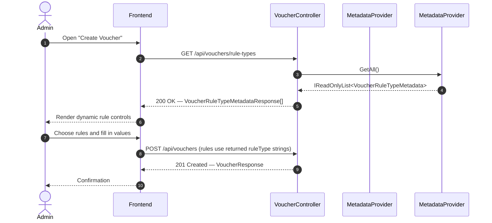

# Voucher Rule Types API

Technical reference for the `GET /api/vouchers/rule-types` endpoint. This
document is intended for backend engineers, frontend engineers, and
reviewers integrating with the voucher rule engine.

- **Endpoint:** `GET /api/vouchers/rule-types`
- **Controller:** `CinemaBooking.API.Controllers.VoucherController`
- **Metadata source:** `CinemaBooking.Application.Vouchers.RuleEngine.Metadata.VoucherRuleMetadataProvider`
- **Rule identifiers:** `CinemaBooking.Shared.Constants.VoucherRuleTypes`

---

## 1. Purpose

`GET /api/vouchers/rule-types` exists so that the admin voucher-creation UI
can be rendered dynamically from server-owned metadata, instead of embedding
knowledge about voucher rules into the frontend.

The problem it solves:

- **The frontend must never hardcode `RuleType` values.** Enumerating
  `"Cinema"`, `"Movie"`, `"SeatType"`, etc. in TypeScript would make every
  new rule a coordinated backend + frontend release, and it would allow the
  two sides to disagree silently on spelling, casing, or availability.
- **The backend is the single source of truth.** `VoucherRuleTypes` (the
  constants) and `VoucherRuleMetadataProvider` (the registry) together
  define which rules exist and how they should be edited. The API exposes
  that shape verbatim.
- **New `RuleType`s can be added without modifying the frontend.** As long
  as a new rule reuses one of the supported `InputType`s and either an
  `Options` list or a `DataSource` URL, the admin form picks it up on the
  next request — no UI code change, no redeploy of the frontend.

The endpoint is a UI-metadata contract. It does not carry business logic,
and it does not describe validation semantics — those live in each
`IVoucherRuleValidator` implementation.

---

## 2. API Overview

| Attribute            | Value                                                            |
|----------------------|------------------------------------------------------------------|
| URL                  | `/api/vouchers/rule-types`                                       |
| HTTP method          | `GET`                                                            |
| Authentication       | Required — Bearer JWT with the `Admin` role                      |
| Request body         | None                                                             |
| Query parameters     | None                                                             |
| Response type        | `application/json` — array of `VoucherRuleTypeMetadataResponse`  |
| Idempotent           | Yes                                                              |
| Caching              | Registry is static; safe for the client to cache per session     |

### Status codes

| Status | When it is returned                                                      |
|--------|--------------------------------------------------------------------------|
| `200`  | Metadata for every supported rule type was returned.                     |
| `401`  | No bearer token was supplied, or the token is invalid / expired.         |
| `403`  | The caller is authenticated but does not hold the `Admin` role.          |

The endpoint never returns `404`, and it does not surface backend errors —
the registry is in-memory and always available.

---

## 3. Response Model

The response is a JSON array. Each element is a
`VoucherRuleTypeMetadataResponse` describing a single rule.

| Field         | Type                | Nullable | Meaning                                                                                                       |
|---------------|---------------------|----------|---------------------------------------------------------------------------------------------------------------|
| `ruleType`    | `string`            | No       | Stable identifier for the rule. Matches a `VoucherRuleTypes` constant and is the value the frontend must POST back inside `VoucherRule.RuleType`. |
| `displayName` | `string`            | No       | Human-readable label to render next to the rule's editor (e.g., in the admin form).                           |
| `inputType`   | `string`            | No       | Which UI control the frontend should render. One of `select`, `multiselect`, `text`, `number`. See §4.        |
| `dataSource`  | `string`            | Yes      | Absolute API path the frontend can `GET` to populate the control's choices. Present when the option set is dynamic (e.g., cinemas, movies). |
| `options`     | `string[]`          | Yes      | Static list of allowed values. Present when the option set is fixed at build time (e.g., days of the week).   |

Rules for `dataSource` vs. `options`:

- **Exactly one** of `dataSource` or `options` is populated for `select` /
  `multiselect` rules. The frontend chooses which control to render based
  on `inputType`, then chooses where to source choices based on which of
  the two fields is non-null.
- Both are `null` for free-form inputs (`text`, `number`). The frontend
  accepts arbitrary user input and validates only the shape.
- `options` values are wire-stable strings — send them back verbatim as
  `VoucherRule.RuleValue`. Do not translate or reformat them.

---

## 4. Supported Input Types

The `inputType` field takes one of four values, defined by
`VoucherRuleInputTypes`.

| `inputType`    | Frontend rendering                                                                                                                            |
|----------------|-----------------------------------------------------------------------------------------------------------------------------------------------|
| `select`       | Single-choice dropdown. Populate options from `options` (static) or by fetching `dataSource` (dynamic). Submit one string as `RuleValue`.     |
| `multiselect`  | Multi-choice control (checkbox group, tag input, etc.). Populate options the same way as `select`. Submit selections as a delimited string, matching whatever format the corresponding validator expects. |
| `text`         | Free-form single-line text field. Neither `options` nor `dataSource` is provided. Submit the raw string.                                      |
| `number`       | Numeric input. Neither `options` nor `dataSource` is provided. Submit the value as a numeric string.                                          |

The constants are string literals on the wire — never translate them into a
frontend enum backed by different keys. Compare against
`"select" | "multiselect" | "text" | "number"` and render accordingly.

---

## 5. Current Supported RuleTypes

The registry is defined in
`VoucherRuleMetadataProvider.Registry`. As of this document:

| RuleType        | Display Name     | Input Type    | Data Source              | Description                                                                                                     |
|-----------------|------------------|---------------|--------------------------|-----------------------------------------------------------------------------------------------------------------|
| `ApplyScope`    | Apply Scope      | `select`      | *(static options)*       | Restricts which subtotal the discount targets: `Order`, `Ticket`, or `Food`. Also drives the applicable-amount calculation inside the rule engine. |
| `Cinema`        | Cinema           | `select`      | `/api/cinemas`           | Voucher only applies when the booking is at the specified cinema.                                               |
| `Movie`         | Movie            | `select`      | `/api/movie`             | Voucher only applies when the booking is for the specified movie.                                               |
| `Room`          | Room             | `select`      | `/api/rooms`             | Voucher only applies when the booking is for the specified room.                                                |
| `SeatType`      | Seat Type        | `multiselect` | `/api/seat-types`        | Every seat in the booking must belong to one of the selected seat types.                                        |
| `Membership`    | Membership       | `select`      | `/api/membership/tiers`  | Voucher only applies to customers holding the specified membership tier.                                        |
| `PaymentMethod` | Payment Method   | `select`      | *(static options)*       | Voucher only applies when the customer is paying via the specified method (PayOS, Wallet, Cash, Momo, CreditCard, Banking). |
| `DayOfWeek`     | Day Of Week      | `multiselect` | *(static options)*       | Voucher only applies when the showtime falls on one of the selected weekdays (`Monday` … `Sunday`).             |
| `Product`       | Product          | `select`      | `/api/products`          | Booking must contain the specified concession product.                                                          |
| `FoodCategory`  | Food Category    | `text`        | *(free-form)*            | Booking must contain at least one product whose category matches the entered string (case-insensitive).         |

Static option values:

- `ApplyScope` → `Order`, `Ticket`, `Food` (from `ApplyScopes`).
- `PaymentMethod` → `PayOS`, `Wallet`, `Cash`, `Momo`, `CreditCard`, `Banking` (from `PaymentMethod`).
- `DayOfWeek` → `Monday`, `Tuesday`, `Wednesday`, `Thursday`, `Friday`, `Saturday`, `Sunday` (from `System.DayOfWeek`).

---

## 6. Example Response

The response mirrors the current `VoucherRuleMetadataProvider.Registry`
1:1. A truncated example:

```json
[
  {
    "ruleType": "ApplyScope",
    "displayName": "Apply Scope",
    "inputType": "select",
    "dataSource": null,
    "options": ["Order", "Ticket", "Food"]
  },
  {
    "ruleType": "Cinema",
    "displayName": "Cinema",
    "inputType": "select",
    "dataSource": "/api/cinemas",
    "options": null
  },
  {
    "ruleType": "Movie",
    "displayName": "Movie",
    "inputType": "select",
    "dataSource": "/api/movie",
    "options": null
  },
  {
    "ruleType": "Room",
    "displayName": "Room",
    "inputType": "select",
    "dataSource": "/api/rooms",
    "options": null
  },
  {
    "ruleType": "SeatType",
    "displayName": "Seat Type",
    "inputType": "multiselect",
    "dataSource": "/api/seat-types",
    "options": null
  },
  {
    "ruleType": "Membership",
    "displayName": "Membership",
    "inputType": "select",
    "dataSource": "/api/membership/tiers",
    "options": null
  },
  {
    "ruleType": "PaymentMethod",
    "displayName": "Payment Method",
    "inputType": "select",
    "dataSource": null,
    "options": ["PayOS", "Wallet", "Cash", "Momo", "CreditCard", "Banking"]
  },
  {
    "ruleType": "DayOfWeek",
    "displayName": "Day Of Week",
    "inputType": "multiselect",
    "dataSource": null,
    "options": ["Monday", "Tuesday", "Wednesday", "Thursday", "Friday", "Saturday", "Sunday"]
  },
  {
    "ruleType": "Product",
    "displayName": "Product",
    "inputType": "select",
    "dataSource": "/api/products",
    "options": null
  },
  {
    "ruleType": "FoodCategory",
    "displayName": "Food Category",
    "inputType": "text",
    "dataSource": null,
    "options": null
  }
]
```

---

## 7. Frontend Flow

The admin voucher-creation flow is metadata-driven end to end:

```
Admin opens "Create Voucher"
        │
        ▼
Frontend calls GET /api/vouchers/rule-types
        │
        ▼
Backend returns rule-type metadata (see §6)
        │
        ▼
Frontend renders one dynamic control per entry, using:
   • displayName as the label
   • inputType to pick the control
   • options or dataSource to populate choices
        │
        ▼
Admin picks which rules to attach and fills in values
        │
        ▼
Frontend POSTs to /api/vouchers with the assembled rules
```

The rules array submitted to `POST /api/vouchers` uses the exact
`ruleType` strings returned by this endpoint, paired with the value chosen
in the corresponding control:

```json
{
  "rules": [
    { "ruleType": "ApplyScope",    "ruleValue": "Ticket" },
    { "ruleType": "Cinema",        "ruleValue": "12" },
    { "ruleType": "DayOfWeek",     "ruleValue": "Friday" }
  ]
}
```

**Invariant:** no file in the frontend codebase should contain a hardcoded
`RuleType` string, a hardcoded option list, or a switch/if-ladder over
rule identifiers. Everything about *which* rules exist and *how* they are
edited comes from this endpoint.

---

## 8. Backend Architecture

The endpoint sits on top of three collaborating components:

```
VoucherRuleMetadataProvider   (registry — one entry per supported rule)
        │  implements
        ▼
IVoucherRuleMetadataProvider  (contract used by controllers)
        │  injected into
        ▼
VoucherController.GetRuleTypes  → HTTP JSON
        │
        ▼
Frontend
```

- **`VoucherRuleMetadataProvider`** owns a static registry of
  `VoucherRuleTypeMetadata` records. It is registered as a singleton in
  `Application.DependencyInjection` because the registry is immutable at
  runtime.
- **`IVoucherRuleMetadataProvider`** decouples the controller from the
  concrete registry, so tests can supply a fake and future providers
  (e.g., DB-backed) can be swapped in without touching the API layer.
- **`VoucherController.GetRuleTypes`** projects each
  `VoucherRuleTypeMetadata` onto a `VoucherRuleTypeMetadataResponse` DTO
  and returns the list. It contains no rule-specific logic.

### Why this follows the Open/Closed Principle

Adding a new rule type is an *extension*, not a *modification*, of the
system's user-visible surface:

- The API contract (`GET /api/vouchers/rule-types` returning an array of
  `VoucherRuleTypeMetadataResponse`) does not change.
- The controller (`VoucherController.GetRuleTypes`) does not change.
- The DTO (`VoucherRuleTypeMetadataResponse`) does not change.
- The DI wiring does not change.
- The frontend does not change.

Only the registry (`VoucherRuleMetadataProvider.Registry`) and the new
validator implementation are added. Every touched file is *appended to*,
never *rewritten*.

---

## 9. How to Add a New RuleType

Illustrated with a hypothetical `Genre` rule (voucher only applies when
the booked movie belongs to a given genre).

1. **Add a constant to `VoucherRuleTypes`.**

   ```csharp
   // CinemaBooking.Shared/Constants/VoucherRuleTypes.cs
   public const string Genre = "Genre";
   ```

2. **Implement `GenreValidator`** in
   `CinemaBooking.Application/Vouchers/RuleEngine/Validators/`:

   ```csharp
   public sealed class GenreValidator : IVoucherRuleValidator
   {
       public string RuleType => VoucherRuleTypes.Genre;

       public ValidationResult Validate(VoucherRule rule, VoucherValidationContext context)
       {
           // domain-specific check here
       }
   }
   ```

3. **Register the validator** by adding an instance to the array in
   `VoucherRuleEngine.InitializeValidators()`:

   ```csharp
   new GenreValidator(),
   ```

4. **Add a metadata entry** to
   `VoucherRuleMetadataProvider.Registry`:

   ```csharp
   new VoucherRuleTypeMetadata(
       RuleType:    VoucherRuleTypes.Genre,
       DisplayName: "Genre",
       InputType:   VoucherRuleInputTypes.Select,
       DataSource:  "/api/genres"),
   ```

That is the entire change. Explicitly **not** needed:

- No `VoucherController` changes.
- No DTO changes (`VoucherRuleTypeMetadataResponse` already covers it).
- No frontend code changes.
- No DI registration changes (the singleton binding for
  `IVoucherRuleMetadataProvider` already covers the new entry, and the
  engine constructs validators internally).

After deploying the backend, the admin form automatically gains a new
"Genre" control on the next `GET /api/vouchers/rule-types` call.

---

## 10. Best Practices

- **Backend owns the metadata.** Anything the UI needs to render a rule's
  editor comes from `VoucherRuleMetadataProvider`. Do not fork this
  knowledge into another service or into the frontend.
- **Frontend never hardcodes `RuleType`s.** No enum, no switch, no
  literal string comparisons on rule identifiers. Render from the array
  returned by the API.
- **`VoucherRuleTypes` constants are the single source of truth.** Every
  validator, every registry entry, and every downstream comparison
  references these constants. Do not reintroduce string literals for a
  rule that already has a constant.
- **Validators contain business logic.** Whether a given rule *holds* for
  a given booking is decided inside an `IVoucherRuleValidator`. The
  metadata layer never encodes eligibility rules — only rendering hints.
- **Metadata only describes UI rendering.** `DisplayName`, `InputType`,
  `DataSource`, and `Options` are for the admin form. They must not leak
  into validation, pricing, or persistence logic.

---

## 11. Sequence Diagram



---

## 12. Future Extensions

The contract is designed so that additional rule types can be introduced
without breaking existing clients. Plausible future candidates — each
addable by following the four steps in §9 — include:

- **`Genre`** — restrict the voucher to movies of a given genre.
- **`Actor`** — restrict the voucher to movies starring a given actor.
- **`AgeRestriction`** — restrict the voucher based on the movie's age
  rating (e.g., only P/K/T13/T16/T18).
- **`Holiday`** — restrict the voucher to specific holiday dates.
- **`CustomerSegment`** — restrict the voucher to a marketing segment
  (new, returning, at-risk, VIP, etc.).
- **`Language`** — restrict the voucher based on the movie's audio /
  subtitle language.
- **`Format`** — restrict the voucher to specific presentation formats
  (`2D`, `3D`, `IMAX`, `4DX`, …).

Each of these can be added purely by extending the registry (plus a
matching validator) — the API contract, the DTO, the controller, and the
frontend all remain unchanged.
